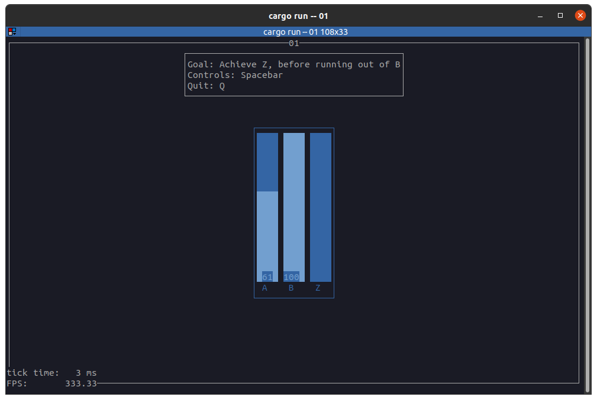

# Rusty Rat Games

A series of very short and simple games while I learn rust and the `ratatui`
framework. These do not contain good architecture, good rust code or enough
comments - these are just quick sketches with a focus on getting to a working
game.

## Running

Once you have [rust installed](https://rust-lang.org/tools/install/):

```sh
# if you're on linux:
## and on debian/ubuntu/etc, install audio deps:
sudo apt install -y libasound2-dev
## or on fedora:
sudo dnf install -y alsa-lib-devel

git clone https://github.com/GSGBen/rusty-rat-games
cd rusty-rat-games
# to see a list of games
cargo run
# to run a specific game, e.g.
cargo run -- 01
```

## Requirements

Any modern terminal should work. I usually run these at 207x55 but it should
work on slightly smaller ones too.

## Credits

- sfx: https://kenney.nl/

## screenshots

